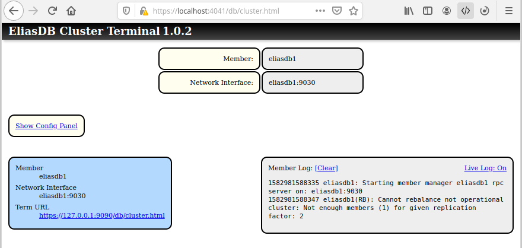
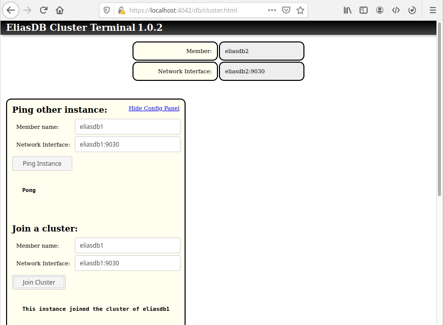
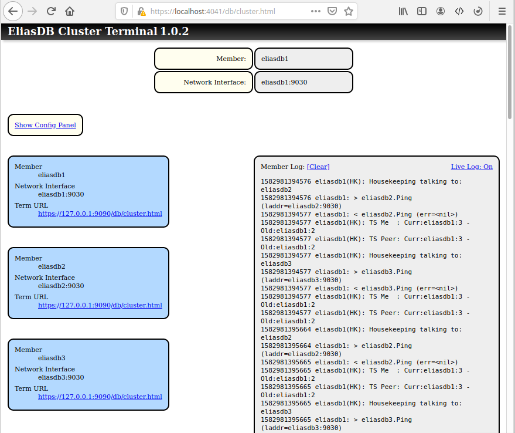

EliasDB Clustering
==================

_Disclaimer: This feature has not been tested extensively - please don't use it for mission critical projects._

Multiple instances of EliasDB can be joined together into a cluster. The cluster has a peer-to-peer character, all members are equal and there is no coordinator. All operations send to any of the wrapper instances are distributed to one or more cluster members.

The cluster provides automatic configuration distribution, communication security and failure detection. The cluster is secured by a shared secret which is never directly transmitted via the network. A periodic housekeeping task is used to detect member failures and synchronizing member state.

Conflicts are usually solved by a simple "last one wins" policy. The cluster only provides eventual consistency by running background tasks. The design favours availability rather than 100% consistency. Data is synchronized between members using simple Lamport timestamps. Recovering members are not updated immediately and may deliver outdated results for some time.

Depending on the configured replication factor each stored datum is replicated to multiple members in the cluster. The cluster size may expand or shrink (if replication factor > 1). Given a replication factor of n the cluster becomes inoperable when more than n-1 members fail.

Enabling Clustering
--
To enable clustering change in `eliasdb.config.json` the following:
```
    "EnableCluster": true,
    "EnableClusterTerminal": true,
```
This will enable the clustering code and provide a rudimentary control UI.

Create a file called `cluster.config.json` to identify each member:
```
{
    "ClusterMemberName": "member1",
    "ClusterMemberRPC": "member1:9030",
    "ClusterSecret": "secret123",
    "ReplicationFactor": 2
}
```
This will name the cluster member `member1` and open the cluster RPC port 9030 on the member host. The cluster secret should be the same for all cluster members and is used to verify that a cluster member is authorized to be part of the cluster. The replication factor defines on how many members each bit of information should be stored and thus how many member can fail without compromising data integrity (n-1). For example in a cluster of 2 or more machines, with a replication factor of 2, one member can fail and the cluster would still be operational.

Building a cluster
--
Each cluster starts with a single member and is build by other members joining the cluster. The joining process can be started via the cluster terminal via the `Config Panel`. To view the cluster terminal point a browser on a given cluster member at `/db/cluster.html`.



For example: Given a cluster of 3 instances (eliasdb1, eliasdb2 and eliasdb3) the first step would be to join eliasdb2 with eliasdb1:



The next step would be to join eliasdb3 with eliasdb1. All further processes happen automatically once the cluster is joined.


