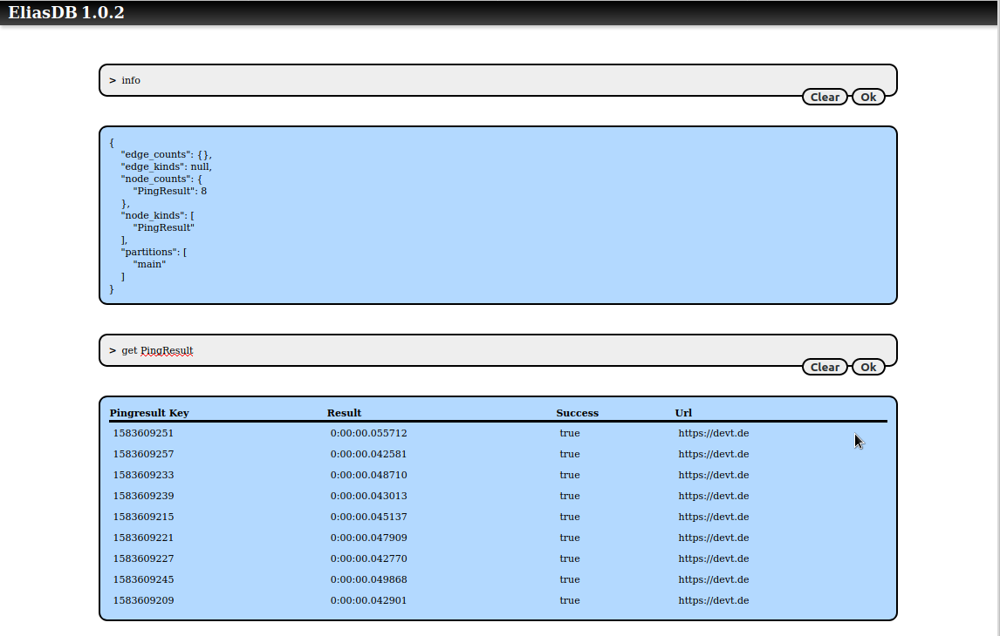
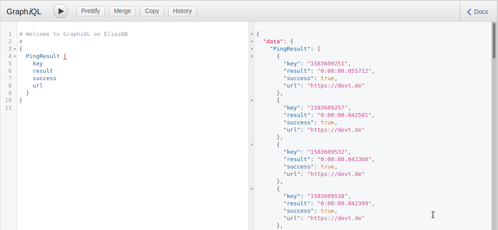

EliasDB Data Mining Example
==
This example demonstrates a more complex application which uses the cluster
feature of EliasDB and GraphQL for data queries.

The idea of the application is to provide a platform for data mining with 3 components for presentation, collection and storage of data. The data which is being collected are request response times of the domain `devt.de`.

The tutorial assumes you have downloaded EliasDB, extracted and build it.
It also assumes that you have a running docker environment with the `docker` and `docker-compose` commands being available. This tutorial will only work in unix-like environments.

For this tutorial please execute `build.sh` in the subdirectory: examples/data-mining and run `docker-compose up` in the same directory.

After running build.sh you should see the following docker images in the local docker registry:

```
> docker images

REPOSITORY                   TAG                 IMAGE ID            CREATED             SIZE
data-mining/collector        latest              3a159822c9e6        6 minutes ago       174MB
data-mining/frontend         latest              c412dbd46dce        16 hours ago        22.7MB
data-mining/eliasdb3         latest              c079c1ad876e        17 hours ago        20.9MB
data-mining/eliasdb2         latest              b53ec5dfdcfb        17 hours ago        20.9MB
data-mining/eliasdb1         latest              83fddb8783df        17 hours ago        20.9MB
```

After running `docker-compose up` you should see 5 containers starting with the collector container continuously gathering ping results and storing it into the running EliasDB cluster.

You can query the state of the database by pointing a browser at:
```
http://localhost:4040/db/term.html
```
You can query for `PingResult` nodes:



You can also use a GraphiQL interface by pointing a browser at:
```
http://localhost:4040/graphiql/
```
You can also here query for `PingResult` nodes:



You can log into a running EliasDB container and query its disk usage:
```
> docker exec -it eliasdb1 sh

/data # du -h
2.2M	./db
48.0K	./web/db
56.0K	./web
12.0K	./ssl
2.3M	.

/data # df -h
Filesystem                Size      Used Available Use% Mounted on
overlay                 240.1G     43.3G    184.5G  19% /
...
```

Finally you can see a graph of the collected data by navigating to:
```
http://localhost:4040/
```


