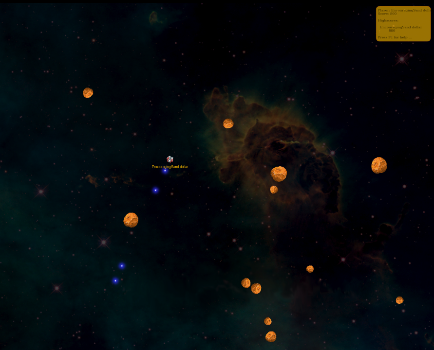
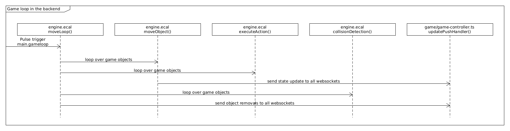
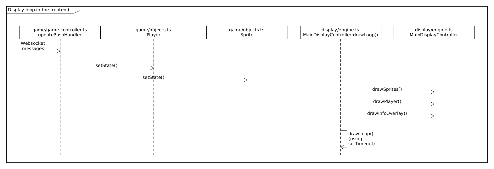
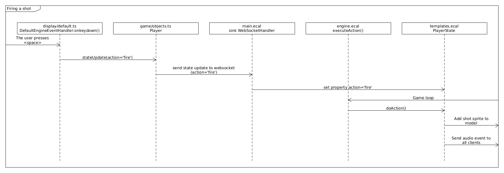

EliasDB Game Example
==
This example demonstrates a game which uses [ECAL](https://devt.de/krotik/ecal) scripts for its backend. The game is a simple [Asteroids](https://en.wikipedia.org/wiki/Asteroids_(video_game)) game clone using modern graphics.

<p align="center">
  
</p>

The game is played in a browser using EliasDB as a webserver. It supports multiple players by simulating a single model in the backend. Model updates are streamed to connected clients via Websockets.

See gameplay footage: [1](game-capture0.mp4) [2](game-capture1.mp4)

## How to start

The tutorial assumes you have downloaded EliasDB, extracted and build it. For this tutorial please execute "start.sh" in the subdirectory: examples/game

After starting EliasDB point your browser to:
```
https://localhost:9090
```

The generated default key and certificate for https are self-signed which should give a security warning in the browser.  After accepting you should see a prompt asking for the game and the player name. In the moment only the game "main" is supported. The player name can be freely chosen.

## Design
Conceptionally the game runs through 2 loops running in parallel to each other. One loop, called the game loop, calculates the game model in discreet time intervals using vector geometry. The other loop, called the display loop, displays the model by redrawing the current scene as fast as possible.

The game loop runs in the backend and used ECAL's [pulse trigger](https://devt.de/krotik/ecal/src/master/ecal.md#setpulsetriggermicros-eventname-eventkind) to generate periodic model update events.

<p align="center">
  
</p>

The display loop runs on the client in the displaying browser using an asynchronous looping mechanism through function calls with setTimeout.

<p align="center">
  
</p>

It is possible to connect multiple browsers each controlling a separate Player in the game. The communication between the game loop in the backend and each display loop in the connected clients is done through Websockets with the server pushing model updates to all clients.

A good example to illustrate the interaction between the components is firing a shot.

<p align="center">
  
</p>

By pressing a button a player adds a "shot" object to the model and a "shot" audio event is send to all connected clients (the actual sound is calculated based on the owner name). The trajectory and speed of the shot sprite is calculated by the game loop using [vector arithmetic](https://www.mathsisfun.com/algebra/vectors.html) and if a collision is detected then the collision() function of the involved objects (see templates.ecal) is executed. For example a Player object would be removed by returning the player ID or an asteroid with be split into particles if it has a certain size. Note that the change in score is defined in the collision() function of the shot only if it collided with an asteroid.

A detailed description of all files of the example game can be found below:

### Backend
The backend code under `res/scripts` contains the game loop which simulates the model. The game loop is written in [ECAL](https://github.com/krotik/ecal) and runs inside the EliasDB process.

| File | Description |
| --- | --- |
| const.ecal | Definition of object kinds and errors. |
| engine.ecal | The GameEngine object which contains the code for the game loop. |
| helper.ecal | General helper functions. |
| main.ecal | All sink definitions. These are used for all data entry point via the web interface and for the game loop. |
| templates.ecal | Contains implementation of all model objects classes which will be simulated by the game loop. |

### Frontend
The frontend code under `res/frontend` contains the display loop written in TypeScript. It can be build easily using `npm` with:
```
$> npm -i
$> npm run build
```  

| File | Description |
| --- | --- |
| frontend.ts | Provides the entry start() function. Here we mainly create objects and put them together. After registering the game world, creating a websocket for backend communication and registering the actual player the game is started once the first update is received through the websocket. |
| helper.js | General helper functions. |

#### backend/

| File | Description |
| --- | --- |
| api-helpers.ts | Library to send requests to the ECAL backend via normal HTTP requests and websockets. |
| asset-loader.ts | Loader object to preload game assets such as images and sounds. |
| eliasdb-graphql.ts | GraphQL client library for EliasDB. This library supports subscriptions. |
| types.ts | Interface definitions for backend data structures. |

#### display/

| File | Description |
| --- | --- |
| default.ts | Abstract classes which implement some functionality of the display related interface definitions. |
| engine.ts | MainDisplayController - Object containing the draw loop which visualises the current state of the game model. |
| types.ts | Display related interface definitions. |

#### game/
| File | Description |
| --- | --- |
| game-controller.ts | MainGameController - Contains only a communication handler to handle messages from the actual game controller in the backend. |
| lib.ts | Game related library functions and objects. |
| objects.ts | Implementation of game objects. |
