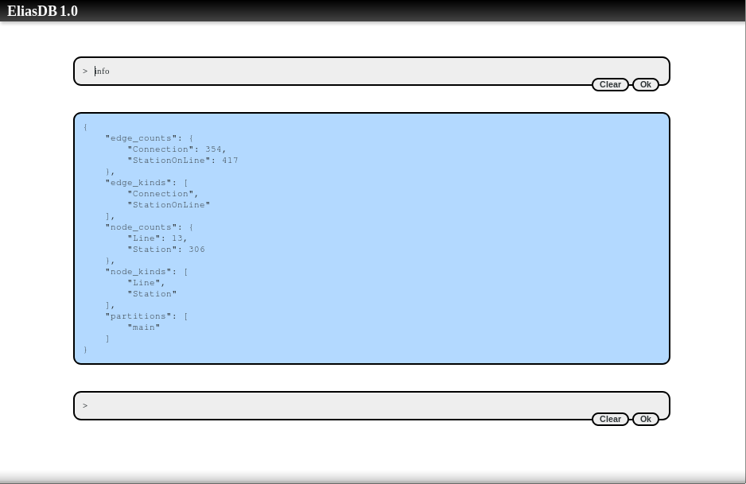
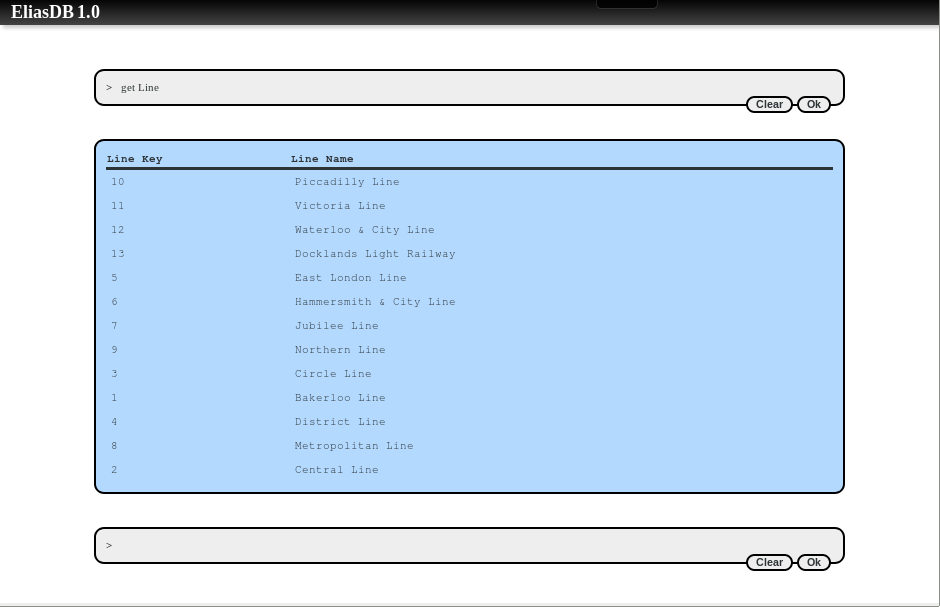
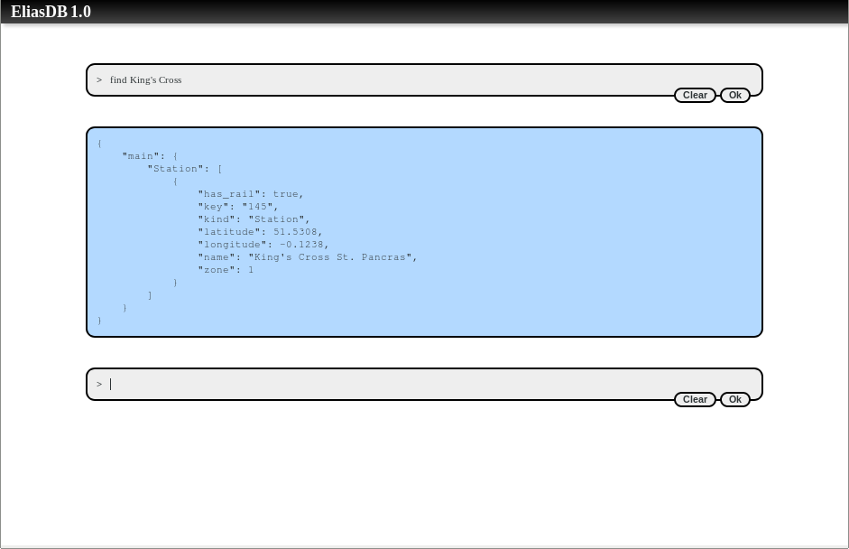

EliasDB Tutorial
================
The following text will give you an overview of the main features of EliasDB. It shows how to run simple queries against a graph structure.

The tutorial assumes you have downloaded EliasDB and extracted it. For this tutorial please execute "start.sh" or "start.bat" in the subdirectory: examples/tutorial

The first run will import data from examples/tutorial/res/tutorial_data.zip into the datastore. EliasDB stores its data in logical partitions. A graph cannot span multiple partitions. Each file in tutorial_data.zip will be imported into a separate partition. For this tutorial we only fill the `main` partition.


Using the Web Terminal
----------------------
By default EliasDB starts on port 9090. The terminal can be accessed via a browser:
```
https://localhost:9090/db/term.html
```

The generated default key and certificate for https are self-signed which should give a security warning in the browser. After accepting you should see a prompt.



You can get an overview of all available command by typing:
```
help
```
Pressing just enter inserts a line break. Pressing Shift+Enter submits a command. Run the "info" command and confirm that the datastore has data loaded. The datastore is filled with a simple graph. It has Station nodes which represent tube stations and Line nodes which represent tube lines. The Station nodes are connected via Connection edges to each other and via StationOnLine edges with Line nodes. Nodes and edges in the datastore are identified by the kind and the key attribute. A node key needs to be unique per node kind.

If you open the browser's development toolbar (usually press F12) you can see how the terminal is communicating with the REST API.


Query data with EQL
-------------------
Data in the datastore can be queried using EliasDB's own query language called EQL. A query will only be able to see the nodes of the partition it is run against. You can change the current partition with the part command. The default is main and that is fine for this tutorial. To get a list of all stored tube lines run the command:
```
get Line
```
The result should be a table of tube lines. Each line having a unique key and a name.



We can easily order the table by name by writing:
```
get Line with ordering(ascending name)
```
The main purpose of a graph database is connecting data and form a graph. We can see which stations are on the "Circle Line" by traversing the graph. Run a lookup query:
```
lookup Line "3" traverse Line:StationOnLine:Member:Station end
```
We lookup a single node in the datastore and follow its edges with Stations. Every successful traversal will add a separate line to the result (i.e. the number of result rows grows exponentially with the number of queried traversals). The edge is specified in full, we could also omit parts of the traversal spec which would then serve as wildcards. For example to follow all relationships we could write :::. Another way of writing this query would be:
```
get Line where key = "3" traverse Line:StationOnLine:Member:Station end
```
Though, the result is the same, this query is significantly more inefficient. The back end has to go over all nodes and test if they match the where clause while a lookup query can use an efficient direct lookup.

We can now refine the query further by only asking for stations with rail connections:
```
lookup Line "3" traverse Line:StationOnLine:Member:Station where has_rail end
```
To control the data which is displayed we can specify a show clause:
```
lookup Line "3" traverse Line:StationOnLine:Member:Station where has_rail end show Station:name, Station:zone
```
In the last refinement of the search query we can order by name:
```
lookup Line "3" traverse Line:StationOnLine:Member:Station where has_rail end show Station:name, Station:zone with ordering(ascending name)
```
Using the with clause we defined here a post-processing function which sorts the result once all data has been retrieved from the datastore.

For further information on search queries please see the EQL documentation [here](https://devt.de/krotik/eliasdb/src/master/eql.md).

Doing a fulltext search
-----------------------
All data which is stored in EliasDB is indexed in a phrase index. The index can be queried from the terminal using the find command.
```
find King's Cross
```
The query should return the Station `King's Cross`. The index can efficiently lookup words, phrases (multiple consecutive words) and attribute values. Use the index endpoint in the REST API for more specific lookups.


