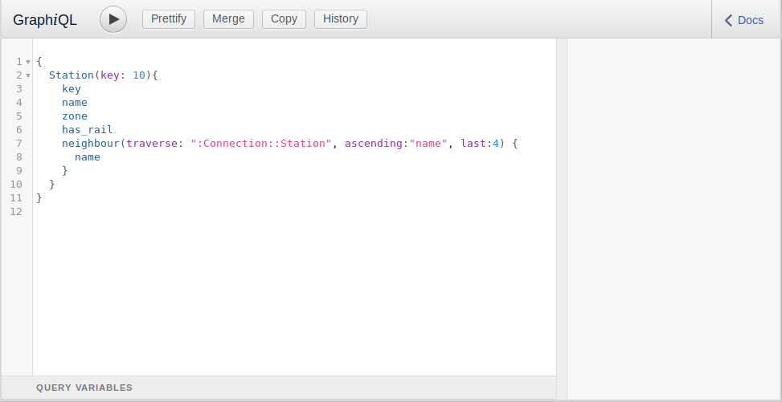
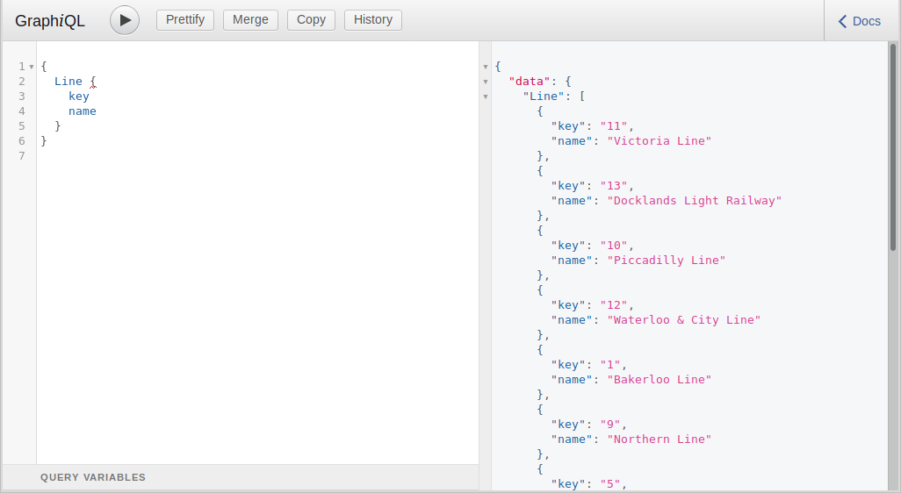
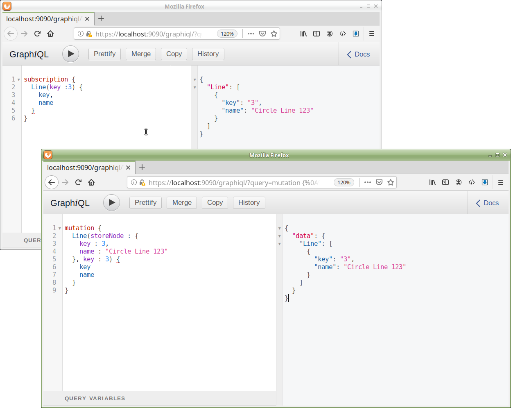

EliasDB GraphQL Tutorial
========================
The following text will give you an introduction to the GraphQL interface of EliasDB. The tutorial will use GraphiQL as a graphical interactive in-browser GraphQL IDE (see [https://github.com/graphql/graphiql](https://github.com/graphql/graphiql))

The tutorial assumes you have downloaded EliasDB and extracted it. For this tutorial please execute "start.sh" or "start.bat" in the subdirectory: examples/tutorial

The first run will import data from examples/tutorial/res/tutorial_data.zip into the datastore. EliasDB stores its data in logical partitions. A graph cannot span multiple partitions. Each file in tutorial_data.zip will be imported into a separate partition. For this tutorial we only fill the `main` partition.

Using GraphiQL to run GraphQL queries
-------------------------------------
By default EliasDB starts on port 9090. The GraphiQL UI can be accessed via a browser:
```
https://localhost:9090/graphiql/
```
Note that this UI is only available in this tutorial. GraphiQL is not part of EliasDB like for example the terminal.

The generated default key and certificate for https are self-signed which should give a security warning in the browser. After accepting you should see the UI of GraphiQL.



The UI shows a query by default to give a template for new queries. Run the query to see if the GraphQL interface works.

You can get an overview of all available query types and the database schema by opening the `Docs` side panel. The datastore is filled with a simple graph. It has Station nodes which represent tube stations and Line nodes which represent tube lines. The Station nodes are connected via Connection edges to each other and via StationOnLine edges with Line nodes. Nodes and edges in the datastore are identified by the kind and the key attribute. A node key needs to be unique per node kind.

If you open the browser's development toolbar (usually press F12) you can see how GraphiQL is communicating with the REST API.

It uses the endpoint `https://localhost:9090/db/v1/graphql/main` for `query` and `mutation` GraphQL requests and `https://localhost:9090/db/v1/graphql-subscriptions/main` for `subscription` requests.

#### Mutations

A mutation is a request which modifies and retrieves updated data. To update an existing node or create a new node use the `storeNode` parameter. There is a `storeEdge` parameter for modifying or creating edges. For example:

```
mutation {
  Line(storeNode : {
    key : 3,
    name : "Circle Line 123"
  }, key : 3) {
    key
    name
  }
}
```

#### Subscriptions

A subscription allows a client to subscribe to data changes on the server side. The server notifies the client if the data changes. Subscriptions were only added in a more recent version of the GraphQL specification (June 2018) and have no concrete implementation suggestion (see [GraphQL Spec June 2018](https://graphql.github.io/graphql-spec/June2018/) 6.2.3 Subscription `Delivery Agnostic`). To support `server push notifications` for subscriptions EliasDB uses [WebSockets](https://en.wikipedia.org/wiki/WebSocket) - GraphiQL can support WebSocket based subscriptions with the [`subscriptions-transport-ws`](https://github.com/apollographql/subscriptions-transport-ws) addon. See the [`subscribe()`](https://devt.de/krotik/eliasdb/src/master/examples/chat/res/chat/src/lib/eliasdb-graphql.ts#L167) function in the client library of the `chat` example for a more simple client.

Query data with GraphQL
-----------------------
Data in the datastore can be queried and modified using GraphQL. A GraphQL request will only be able to see the nodes of the partition it is run against. To get a list of all stored tube lines run the command:
```
{
  Line {
    key
    name
  }
}
```
The result should be a list of tube lines. Each line having a unique key and a name.



We can easily order the table by name by writing:
```
{
  Line(ascending:name) {
    key
    name
  }
}
```
The main purpose of a graph database is connecting data and form a graph. We can see which stations are on the "Circle Line" by traversing the graph. Run the following query:
```
{
  Line(key: 3){
    key
    name
    neighbour(traverse: "Line:StationOnLine:Member:Station") {
      key
      name
    }
  }
}
```
We lookup a single node in the datastore and follow its edges with Stations. Every successful traversal will add a separate entry to the result. The shape of the result matches the query. The edge is specified in full, we could also omit parts of the traversal spec which would then serve as wildcards. For example to follow all relationships we could write :::. We can now refine the query further by only asking for stations with rail connections:
```
{
  Line(key: 3){
    key
    name
    neighbour(traverse: ":::", matches : {
      has_rail : true
    }) {
      key
      name
    }
  }
}
```
In the last refinement we specify another attribute to include and an ordering:
```
{
  Line(key: 3){
    key
    name
    neighbour(traverse: ":::", matches : {
      has_rail : true
    }, ascending : name) {
      key
      name
      zone
    }
  }
}
```

Mutation and Subscription
-------------------------
Open another browser window with the GraphiQL interface and run a subscription on the `Circle Line` node:
```
subscription {
  Line(key :3) {
    key,
    name
  }
}
```
After running the request the output window shows now a live view of the data in the database!

Running now a `mutation` request in the other window should change the displayed data. Run the following request in the browser window which does not run the subscription:
```
mutation {
  Line(storeNode : {
    key : 3,
    name : "Circle Line 123"
  }, key : 3) {
    key
    name
  }
}
```

